# XSTATION Landing Page Unification: Hero World Continues Below the Fold

| Field | Value |
|---|---|
| **Author** | Design Engineering (draft) |
| **Date** | 2026-08-31 |
| **Status** | Approved |
| **Target page** | `/Users/kevinananda/Codes/xstation-2/index.html` |
| **Stack** | Vanilla HTML + CSS + JS. GSAP 3.14.2 + ScrollTrigger + Lenis 1.1.21. Three.js 0.181.2 boot only. |
| **Redesign mode** | Visual overhaul. IA and copy preserved. |
| **Dials** | DESIGN_VARIANCE 6 · MOTION_INTENSITY 7 · VISUAL_DENSITY 3–4 |

This is a frontend design-engineering plan for the live full page. The hero isolate at `videos/gateway-hero/index.html` is a reference, not the ship target. Do not introduce Motion/framer-motion. Do not add a second animation library. All new scroll/pin work is GSAP + ScrollTrigger.

---

## Overview

The live page is two products glued together. Above the fold, `#root` is a sealed 100svh capsule: 22 emissive CSS 3D slabs in a black void, an octagonal Three.js boot that tears itself down, Apfel Grotezk title, gold as light. Below the fold, `#work-root` is an editorial-architecture magazine: navy panels (`#07111c`), gold-filled tab chips, ghost “XSTATION” watermark, overlay titles (“Copilot” on a Manhattan street, “Relay” on a craft workshop), and photography of streets, lofts, libraries, and scaffolding. The two languages fight.

The locked product decision is option A: **the rest of the page becomes the hero’s world.** Instruments, void, light. Not a better handoff onto architecture photography. This document specifies how to pin the hero, pass the visitor through the slab field into doctrine, restyle every body surface to ivory/gold/steel/void, recycle instrument stills from `videos/gateway-hero/media/`, replace the fade-up/parallax motion language with a single Z-approach, and ship it as four independently mergeable PRs (PR1–PR4). Quorum sequence-scroll (PR5) is a deferred follow-up, not in this program.

---

## Background & Motivation

### Current state (verified against files)

**Hero** (`index.html` lines 64–325, inline IIFE lines 550–676):

- `#root` is `height: 100svh; min-height: 720px; overflow: hidden` — a sealed capsule. Nothing below can share its field.
- 22 `.slab` divs in `#field` (`perspective: 1100px`). Constants: `DURATION = 8`, `FAR = -1880`, `NEAR = 620`, seed `0xa5c11e`, palette `ivory×4, steel×2, gold, dim`.
- Loop is a GSAP timeline on a `{ t }` proxy, `repeat: -1`, `ease: "none"`, `layout(t)` via `gsap.set` (x/y/z, tilt, `autoAlpha`). Starts paused; plays on `gateway:reveal`.
- Boot: `videos/gateway-hero/loader.js` (ES module, Three.js + UnrealBloom). Octagonal frames + gold scan + `#boot-fill` rail. `revealHero()` sets `window.__gatewayReady` and dispatches `gateway:reveal` at the start of EXIT (1.4s), then `teardown()` disposes the renderer and `boot.remove()`.
- Title: “Your Gateway To Intelligent Products”.
- Nav: XSTATION / Work / Contact. `position: fixed; z-index: 12` but **DOM-child of `#hero`**. This will break if `#root` is pinned.

**Body** (`#work-root`, `videos/gateway-hero/work.css` + `work.js`):

- `.doctrine` manifesto + `.doctrine-band` photo `media/lattice-towers.jpg`.
- `.chapter` ghost type + overlay h2 “Copilot” + `.work-card` + `.place-map`.
- `.space` / `.space.is-flip` zigzag sheets with About/System tabs, 3-column `<dl class="specs">` hairlines, thumbs: Kite, Meridian, Quorum.
- `.stage` full-bleed Relay with centered overlay title.
- `.inquiry` mailto form.
- `work.js`: Lenis (`duration: 1.6`, `lerp: 0.055`) wired with `lenis.on("scroll", ScrollTrigger.update)` + `gsap.ticker`. Parallax via `[data-parallax]` + ken-burns on chapter/band images. Enter: `y: 28, autoAlpha: 0, duration: 0.85, ease: "power3.out"` on `.space-panel, .stage-card, .inquiry-form`.

**Wrong-world media currently referenced** (all under `media/`): `lattice-towers.jpg`, `helios-city.jpg`, `helios-loft.jpg`, `gallery-corridor.jpg`, `gallery-column.jpg`, `northstar-plaza.jpg`, `meridian-library.jpg`, `loom-workshop.jpg`, `veil-glass.jpg`. Already unreferenced: `doctrine-figure.jpg`, `editorial-window.jpg`.

**Right-world media already on disk** (all 1280×720 except `vista.jpg` 1152×864): `videos/gateway-hero/media/{aether,forge,forge-still,harbor,harbor-still,prism,prism-still,signal,signal-still,thread,thread-still,vista}.jpg`. Byte-identical pairs: `forge`=`forge-still`, `harbor`=`harbor-still`, `prism`=`prism-still`, `thread`=`thread-still`. Distinct extra: `signal-still.jpg` (laptop + gold wireframe, not a duplicate of `signal.jpg`).

### Pain

The hero is a cinematic void. The body is a different site. Navy panels reintroduce a second theme. Gold is used as filled-chip paint. Overlay titles and ghost watermarks are editorial-architecture devices. Parallax ken-burns on street photography doubles down on the wrong material. Visitors who wait through the Three.js gate are dropped into a magazine.

---

## Goals & Non-Goals

### Goals

1. Pin `#root` for **160svh of extra scroll** (`end: "+=160svh"`, not `"bottom top"`) and pass into doctrine through the slab field.
2. Persist a whisper of the field (6 slabs, edge-parked in **viewport units**, peak alpha **0.08**) after pin release; pause it on product surfaces (PR4).
3. Replace architecture photography with instrument/product surfaces in the ivory/gold/steel/void palette. Recycle `videos/gateway-hero/media/` first.
4. One enter language (Z-approach) and gold-as-light. Restyle panels, tabs, specs. Remove ghost watermark and overlay-on-photo titles. Keep doctrine-mark huge type as architecture.
5. Quorum sequence-scroll is **deferred** (user, 2026-08-31). Not in this program. Spec remains in §4.6.1 / PR5 as a later follow-up.
6. Preserve IA, copy, brand tokens, nav labels, product set, and the existing motion stack.

### Non-Goals

- Rewriting marketing copy (except strings mechanically broken by overlay-title removal; those strings are relocated, not rewritten).
- Changing nav labels (Work / Contact) or anchors (`#work` `#kite` `#meridian` `#relay` `#quorum` `#contact`). `#index` and `#root` stay.
- Changing brand tokens or inventing a new accent. Navy `#07111c` is retired, not replaced with a new hue.
- A second live Three.js scene. Three.js remains boot-only.
- Cinematic scroll-hijacks on Kite, Meridian, or Relay.
- Fake product UIs built from `<div>` rectangles.
- Marquees, bento grids, logo walls, custom cursors, neon grids, particle fields, scanlines-as-decoration, holographic foil, glassmorphism-on-everything.
- Mixing Motion/framer-motion with GSAP.
- `window.addEventListener("scroll")` for animation.
- Em-dashes in any user-visible string.
- Scroll cue labels (“Scroll to explore”).
- Section-number eyebrows.
- Deleting unused architecture photos in the first PRs (stop referencing; do not delete).
- Editing the hero isolate (`videos/gateway-hero/index.html`) except where a shared module (`field.js`) is naturally reused.
- Porting isolate chrome (`01 Gateway`, isolate `<title>` em-dash) onto the live page.

Use this Non-Goals list as a **PR checklist**. Every PR description must confirm it does not violate any bullet.

---

## Key Decisions

1. **The rest of the page is the hero’s world.** Instruments, void, light. Architecture photography is retired from this page. Rationale: locked product decision (option A). Do not reopen.

2. **Void stays `#000000`.** Taste-skill prefers off-black; we keep pure black because the boot (`renderer.setClearColor(0x000000, 1)`), slab glow, and veil gradients are calibrated against it. Depth for panels is `--surface: #050505`, not a second theme. Do not shift `--bg`. Do not invent an accent.

3. **Pin `#root` with `start: "top top"`, `end: "+=160svh"`, `pinSpacing: false`, inside `#pin-slot`.** Extra scroll, slot extra height, and `#work-root` negative margin are all **`160svh`** (same unit as `#root { height: 100svh }`). Do **not** use `end: "bottom top"` — that pins for the full slot height (~260svh) and the phase table, `setProgress`, and `#work` landing all desync. Default GSAP `pinSpacing: true` would push doctrine fully below the extra scroll and kill “through the field.” Do not combine `pinSpacing: true` *and* `#pin-slot` extra height *and* a negative margin (triple spacer). **Load invariant:** at `scrollY = 0`, doctrine copy sits at the hero’s bottom edge, not under the title. Screenshot that, and `scrollY = 1`.

4. **Hoist `#site-nav` and `#field-stage` out of `#hero`.** Nav is `position: fixed` but a child of the pin target; ScrollTrigger pin would clone/contain it. Field must outlive `#root` to become the whisper. Both become direct children of `body`.

5. **Extract the inline hero IIFE into `videos/gateway-hero/field.js`.** The 22-slab math, seed, and `layout(t)` must be shared by idle, pass, whisper, and pause. Duplicating slab math in `work.js` is forbidden.

6. **Convert `work.js` to an ES module** that imports `field.js`. `loader.js` is already `type="module"`. Keep one motion owner. The inline IIFE in `index.html` lines 550–676 is deleted.

7. **Boot gate reuse is a CSS/SVG octagon + gold scan, not live WebGL.** Geometry cloned from `loader.js` `regularVerts(8, …)`. Pin-scrubbed at the hero→doctrine seam; **replays on reverse scroll, does not autoplay-loop in time.** Reverse winding of SVG points is intentional. `loader.js` teardown is unchanged; Three.js does not survive boot.

8. **Gold is light, never fill, except the one primary action (Send).** Tabs: 1px gold edge, not a gold brick. Focus: 1px gold ring (already). Seam: 1px gold scan **once per pass-through; replays on reverse scrub** (does not autoplay-loop in time). Specs: one readout strip, not a 3-column `<dl>` with a hairline on every row.

9. **Remove `.ghost` and overlay-on-photo titles.** Keep “Copilot” and “Relay” as architecture type (huge Apfel, in the void, not centered on a photograph). Doctrine-mark “Models / In Production” stays.

10. **One Z-approach enter language** replaces `work.js` parallax and `y: 28` fade-up. `scale: 0.94` + slight blur + `autoAlpha: 0` → 1, sharp, `expo.out`, children stagger 60–80ms, `once: true`. No ken-burns. No `[data-parallax]`.

11. **Recycle `videos/gateway-hero/media/` in place.** Reference those paths from `index.html`. Do not copy into `media/` in PR3. **No generation in the first ship** (Decision 18). `prism.jpg` already has UI text and is acceptable as-is.

12. **Quorum sequence-scroll is PR5, deferred by user (2026-08-31). Not in this implementation program.** Keep the spec in §4.6.1 as a later follow-up. One product only. CSS overlays on `prism.jpg`, not new WebGL, not generated UI text. Do not implement until PR1–PR4 have soaked.

13. **`#work-root` background becomes transparent.** Through-field surfaces stay transparent so the field reads: `.doctrine` (PR1) and `.chapter` (from PR2, when the index becomes a void). **Opaque `background: var(--bg)` from PR1 onward:** `.space`, `.stage`, `.inquiry`, `.work-end`. Live CSS already paints `.space` / `.chapter` / `.inquiry`; **PR1 must add `--bg` on `.stage` and `.work-end`** (they currently inherit and would become holes). Do not ship a transparent Relay. `.doctrine-band` is pixel-opaque (a photo, then `vista.jpg`). Gutter leak on `.space` (0.7rem) until PR4 pause is accepted.

14. **No Lenis `normalizeScroll`. No second ticker.** Keep the existing `lenis.on("scroll", ScrollTrigger.update)` + `gsap.ticker` + `lagSmoothing(0)` wiring in `work.js`. `field.js` must not call `gsap.ticker.add` or `lenis.raf`. Add `anticipatePin: 1` and `invalidateOnRefresh: true`. Refresh on `visualViewport.resize` and `orientationchange`. **No sticky-pin fallback in PR1.** If iOS QA records a pin jump, that is a follow-up issue, not a second code path in this plan.

15. **Unused architecture photos are unreferenced, not deleted, until a later cleanup PR.** Rollback is “revert the HTML `src` attributes.” `helios-city.jpg` becomes unreferenced in **PR2** (index markup swap). The rest drop in PR3.

16. **Pin `end` is `+=160svh`.** Slot height `calc(max(100svh, 720px) + 160svh)`. `#work-root { margin-top: -160svh }`. One unit everywhere. See Decision 3.

17. **Opaque-surface list (authoritative):** transparent = `#work-root`, `.doctrine`, `.chapter` (PR2+). opaque `--bg` = `.space`, `.stage`, `.inquiry`, `.work-end`. Field pause (PR4) on `#kite`, `#meridian`, `#relay`, `#quorum` only.

18. **Three thumbs per zigzag product is the end state. No generation in the first ship.** Live markup has 4 `.thumb` buttons. **PR2 keeps the 4-col CSS** (`repeat(4, …)`). **PR3** deletes the fourth `<button class="thumb">` **and** switches `.thumbs` to `repeat(3, …)` in the same PR. Do not restyle to 3-col while four buttons remain. Open Question 1 is closed. Optional atmospheres (`kite-queue`, `meridian-cite`, `quorum-trace`) are a follow-up after PR3 soaks, not part of PR3.

---

## Taste-skill pre-flight (locked)

Apply on every PR that touches the page.

| Dial | Lock | Enforcement |
|---|---|---|
| Theme | Dark / void entire page | `--bg: #000000` on `html, body`. No navy. No light sections. |
| Accent | One: gold `#d4a056` | Gold as light. Fill only on `button[type=submit]` (“Send”). |
| Shape | Radius 0 | Already. Do not add `border-radius` anywhere. |
| Em-dash | Forbidden in user-visible strings | Copy already clean. Do not introduce. Isolate `<title>` em-dash is out of scope (not the live page). |
| Scroll cues | Forbidden | No “Scroll to explore”, no bounce chevron, no progress pill. |
| Eyebrows | 0 | No section-number labels. Isolate `01 Gateway` is not on the live page; do not port it. |
| Zigzag cap | No 3+ consecutive image+text splits | Kite (split) → Meridian (split flip) → Relay (full-bleed, breaks) → Quorum (split). Streak max = 2. |
| Layout families | ≥ 4 | Doctrine band, index void, space zigzag, stage full-bleed, inquiry form. |
| Reduced motion | Mandatory matrix | See §10. |
| Scroll listeners | Forbidden | GSAP ScrollTrigger + Lenis only. No `window.addEventListener("scroll")`. |
| Motion stack | GSAP + ScrollTrigger only | No Motion, no anime, no Lottie. |
| Visual density | 3–4 | Whisper is 6 slabs, not 22. Specs collapse to one strip. No extra chrome. |

---

## Proposed Design

### 1. Scroll choreography spec

#### Canonical DOM after PR1

```html
<body>
  <div id="boot">…</div>                         <!-- z=40, removed after teardown -->
  <div id="field-stage">                         <!-- position:fixed; inset:0; z=2; pointer-events:none -->
    <div id="field"></div>
  </div>
  <header id="site-nav">…</header>               <!-- position:fixed; z=30 -->
  <div id="pin-slot">                            <!-- height: calc(max(100svh, 720px) + 160svh) -->
    <div id="root">                              <!-- height: 100svh; min-height:720px; overflow:hidden; z-index:12; pointer-events:none; bg transparent -->
      <section id="hero">
        <div id="veil"></div>
        <div id="edge-fade"></div>
        <svg id="gate-threshold" aria-hidden="true">…</svg>
        <div id="title-layer"><h1 id="title">…</h1></div>
        <div id="vignette"></div>
      </section>
    </div>
  </div>
  <div id="work-root" class="work-pad">          <!-- margin-top: -160svh; position:relative; z=10; background:transparent -->
    <section class="doctrine" id="work">…</section>
    …
  </div>
</body>
```

Why this shape:

- `#pin-slot` holds the hero’s place in flow (`max(100svh, 720px)`) **plus** `160svh` of pass scroll, so `pinSpacing: false` does not collapse the document.
- `#work-root { margin-top: -160svh }` parks doctrine at the bottom edge of the hero at load. The first **160svh** of scroll (the pin `end`) draws doctrine **up through** the pinned field. After pin release, flow is continuous; no jump.
- **Load invariant:** at `scrollY = 0`, the first viewport is only the hero. Doctrine copy sits at the hero’s bottom edge, not under the title. Screenshot `scrollY = 0` and `scrollY = 1`.
- `#root` background becomes transparent so the hoisted field (z=2) shows through. Body remains `--bg`.
- `#site-nav` is not a pin descendant.
- `#root { pointer-events: none }` so the pinned z=12 stacking context does not eat clicks or text selection on overlapping doctrine. `#site-nav` is hoisted and stays `pointer-events: auto`. `#title-layer` is already `pointer-events: none`.

#### CSS before/after (same `<style>` block in `index.html`)

These rules live in `index.html` today, not `work.css`. PR1 **must** edit this block. Do not rely on `work.css` to restyle `#field-stage` / `#site-nav` / `#root` — an implementer who only follows a work.css bullet will hoist the DOM and leave the field `position: absolute` inside a 100svh `overflow: hidden` capsule.

**Before (live):**

```css
#field-stage { position: absolute; inset: 0; z-index: 0; overflow: hidden; isolation: isolate; pointer-events: none; transform: translateZ(0); }
#site-nav { position: fixed; top: 0; left: 0; right: 0; z-index: 12; /* rest unchanged */ }
#root { position: relative; width: 100%; height: 100svh; min-height: 720px; overflow: hidden; background: var(--bg); }
/* no #pin-slot */
```

**After (PR1, same block):**

```css
#field-stage {
  position: fixed;
  inset: 0;
  z-index: 2;
  overflow: hidden;
  isolation: isolate;
  pointer-events: none;
  transform: translateZ(0);
}
#site-nav {
  position: fixed;
  top: 0; left: 0; right: 0;
  z-index: 30; /* was 12 */
  pointer-events: auto;
  /* padding, type, color unchanged */
}
#root {
  position: relative;
  width: 100%;
  height: 100svh;
  min-height: 720px;
  overflow: hidden;
  background: transparent; /* was var(--bg); field is now behind */
  z-index: 12;
  pointer-events: none;    /* doctrine, under overlap, stays selectable */
}
#pin-slot {
  position: relative;
  height: calc(max(100svh, 720px) + 160svh);
}
```

Companion rules in **`work.css`** (PR1):

```css
#work-root {
  position: relative;
  z-index: 10;
  background: transparent;     /* was var(--bg) */
  margin-top: -160svh;
  color: var(--ivory);
  overflow-x: hidden;
  width: 100%;
  max-width: 100%;
}
.doctrine { background: transparent; }
.stage,
.work-end { background: var(--bg); } /* currently inherit; must not become field holes */
/* .chapter, .space, .inquiry already have background: var(--bg); leave them opaque in PR1 */
```

#### Pin contract (canonical ScrollTrigger)

Register after Lenis is created and `gsap.registerPlugin(ScrollTrigger)`. Do not register during boot; registration is fine immediately because the trigger is scroll-based and `#boot` (z=40) eats pointer/wheel until teardown.

```js
const PASS = "160svh"; // midpoint of locked 140–180 range; SAME unit as #root height and #work-root margin

ScrollTrigger.create({
  id: "hero-pass",
  trigger: "#pin-slot",
  start: "top top",
  end: "+=160svh",            // NOT "bottom top". Extra scroll only, not slot height.
  pin: "#root",
  pinSpacing: false,          // slot already provides height. Do not also set pinSpacing: true.
  scrub: 0.45,                // MOTION_INTENSITY 7; not 1:1, not max
  anticipatePin: 1,
  invalidateOnRefresh: true,
  animation: passTl,          // see phase table
  onEnter: () => field.setMode("pass"),
  onLeave: () => field.setMode("whisper"),      // starts 18s loop AFTER scrub 0.78–1.00 parks/culls
  onEnterBack: () => field.setMode("pass"),
  onLeaveBack: () => field.setMode("idle"),
});

window.visualViewport?.addEventListener("resize", () => ScrollTrigger.refresh());
window.addEventListener("orientationchange", () => ScrollTrigger.refresh());
```

If ScrollTrigger 3.14.2 ignores `svh` in `end` (it understands `vh`/`px`/`%`; `svh` is likely passed to `getComputedStyle` via a dummy), fall back to `end: () => window.innerHeight * 1.6` and keep CSS in `svh`. Do not mix `160vh` in JS with `160svh` in CSS.

Lenis wiring (already in `work.js` `smooth()`, keep as-is). **`ScrollTrigger.normalizeScroll` is forbidden** (it fights this Lenis wiring). **No sticky fallback in PR1.**

```js
lenis.on("scroll", window.ScrollTrigger.update);
window.gsap.ticker.add(function (time) {
  lenis.raf(time * 1000);
});
window.gsap.ticker.lagSmoothing(0);
```

After creating the pin: `ScrollTrigger.refresh()`. Re-refresh on `gateway:reveal` (boot height gone) and `window` `load`.

`?shot=` mode (`work.js` lines 174–186) must skip pin, skip Lenis, skip field loop: hide `#boot` and `#pin-slot`, do not call `field.startIdle()`. `field.destroy()` is optional here (shot never started idle); call it only if a HMR path re-inits.

**iOS:** ship the pin. Listen for `visualViewport.resize` and `orientationchange` as above. If QA on iPhone Safari records a pin jump, open a follow-up; do not land a named sticky branch in this plan.

#### Phase table

Progress is `hero-pass` ScrollTrigger progress in `[0, 1]`. Extra-scroll distances assume **`160svh`**. Pin target is always `#root`. **One owner per field phase:** idle loop is paused/killed on `onEnter` (`setMode("pass")`); `setProgress(p)` (scrub) is the only driver while `mode === "pass"`; scrub 0.78–1.00 parks/culls; `onLeave` (`setMode("whisper")`) starts the 18s loop.

| Phase | Progress | Extra scroll | Pinned | Tweens (scrubbed unless noted) | Reduced motion |
|---|---|---|---|---|---|
| Hold | 0.00–0.08 | 0–13svh | `#root` | Field frozen at captured `passOriginT`, idle x/y (no rail pull). Title `autoAlpha: 1`, `scale: 1`. | No pin. Title visible. **Zero slabs.** |
| Dissolve | 0.08–0.28 | 13–45svh | `#root` | `#title`: `autoAlpha 1→0`, `scale 1→0.985`. **No x/y slide.** Ease `none` (scrub). | Skip. Title stays. |
| Corridor | 0.18–0.72 | 29–115svh | `#root` | `setProgress(p)` (pass only). Instantaneous Z speed **1→3.2** across this window (integrated, not `p * speed`). `#field` perspective `1100px→720px`. Slab `x,y` lerp 40% toward two vertical rails. Peak alpha `×1→×1.35` (cap 0.9). | Skip. |
| Veil lift | 0.32–0.62 | 51–99svh | `#root` | `#veil`, `#vignette`, `#edge-fade`: `autoAlpha 1→0`. Ease `none`. | Leave static. |
| Doctrine through | 0.42–0.85 | 67–136svh | `#root` | Doctrine copy is in document flow overlapping the pin (no tween required to “enter” the viewport). Children of `.doctrine-copy` use Z-approach `once: true` (not scrubbed) when the copy’s top hits `top 78%` (PR4). | Copy in normal flow below hero. No overlap. |
| Gate scan | 0.52–0.64 | 83–102svh | `#root` | `#gate-threshold` `autoAlpha 0→1→0`. `#gate-scan` `y: -1.12 → 1.10`. Gold 1px. Ease `power2.inOut`. **Seam cue.** Replays on reverse scrub; does not autoplay-loop in time. | Skip (`display:none`). |
| Whisper park | 0.78–1.00 | 125–160svh | `#root` | Still `mode === "pass"`. `setProgress` lerps **from the corridor-end pose** (u=1 rails), not from `idleX`, to whisper x/y; culled 16 fade from their current `alphaAt`, not from 1, then `display: none` at p=1. `#field` perspective **720→1100** (scrubbed, `duration: 0.22` at `position: 0.78`). Peak of keepers **0.08**. **Do not** call `setMode("whisper")` here. | No whisper. |
| Release | 1.00 | 160svh | none | Pin releases. `onLeave` → `setMode("whisper")` starts the 18s loop on the 6 parked slabs. `#root` scrolls away with the slot. Field stays `position: fixed`. | n/a |

`passTl` is a **dummy 1-unit timeline**. Pin scrub maps 0–1 onto it. This is the only contract — do not use a 5-arg `fromTo(..., start, end)` form.

```js
const passTl = gsap.timeline();
passTl.fromTo(
  "#title",
  { autoAlpha: 1, scale: 1 },
  { autoAlpha: 0, scale: 0.985, ease: "none", duration: 0.20 },
  0.08
);
passTl.fromTo(
  "#field",
  { perspective: 1100 },
  { perspective: 720, ease: "none", duration: 0.54 },
  0.18
);
passTl.to("#field", { perspective: 1100, ease: "none", duration: 0.22 }, 0.78);
passTl.fromTo(
  "#veil, #vignette, #edge-fade",
  { autoAlpha: 1 },
  { autoAlpha: 0, ease: "none", duration: 0.30 },
  0.32
);
passTl.fromTo(
  "#gate-threshold",
  { autoAlpha: 0 },
  { autoAlpha: 1, duration: 0.06, ease: "power2.out" },
  0.52
);
passTl.to("#gate-threshold", { autoAlpha: 0, duration: 0.08, ease: "power2.in" }, 0.64);
passTl.fromTo(
  "#gate-scan",
  { attr: { y: -1.12 } },
  { attr: { y: 1.10 }, ease: "power2.inOut", duration: 0.12 },
  0.52
);
passTl.to(
  {},
  {
    duration: 1,
    ease: "none",
    onUpdate: function () {
      field.setProgress(this.progress()); // no-ops unless mode === "pass"
    },
  },
  0
);
```

#### Pin-and-pass state

```mermaid
stateDiagram-v2
  [*] --> Boot: loader.js start
  Boot --> Idle: gateway:reveal + field.startIdle()
  Idle --> Pass: ST onEnter (setMode pass; idleTl pause)
  Pass --> Pass: setProgress(p) while mode==pass
  Pass --> Whisper: ST onLeave AFTER scrub park
  Pass --> Idle: ST onLeaveBack (restart idle from captured t)
  Whisper --> Pass: ST onEnterBack
  Whisper --> Paused: product surface in view
  Paused --> Whisper: product surface leaves
  Whisper --> ContactWhisper: #contact in view (same mode, allowed)
  Boot --> Static: prefers-reduced-motion
  Idle --> Static: prefers-reduced-motion
  Static --> [*]
```



```mermaid
sequenceDiagram
  participant User
  participant Lenis
  participant ST as ScrollTrigger
  participant Field as field.js
  participant DOM
  User->>Lenis: wheel/touch
  Lenis->>ST: scroll update
  ST->>DOM: pin #root (start "top top")
  ST->>Field: setMode("pass")
  ST->>DOM: title dissolve, veil lift, gate scan
  ST->>Field: setProgress(p) (no-op unless mode==pass)
  Note over DOM: doctrine copy overlaps, field visible through it
  Note over Field: p 0.78-1.00 parks 6, culls 16 (still pass)
  ST->>Field: setMode("whisper") onLeave
  ST->>DOM: unpin #root
  Note over Field: 18s loop starts on 6 parked slabs; items.length stays 22
```

Anchor `#work` currently points at `.doctrine`. Live Lenis intercepts `#` clicks with `offset: -8` (`work.js` 86–94); CSS `scroll-padding-top: 4.75rem` is ignored by that path. After `margin-top: -160svh` and `end: "+=160svh"`, `#work`’s document Y sits at the hero’s used height, i.e. inside the pass (progress ≈ `100svh / 160svh` ≈ 0.63, which is ≥ 0.55: title is gone, doctrine is in). Implement by scrolling to `#work` as today. **Nudge `offset` in PR1 only if the copy is optically low.** Do not invent a `#work-land` sentinel. Do not add a “Scroll to explore” cue.

---

### 2. Field lifecycle and module API

The idle loop currently lives as an IIFE in `index.html` lines 550–676. It is **not** in `work.js`. Extract it.

**New file:** `videos/gateway-hero/field.js` (ES module).

Keep constants, seed, palette, `mulberry32`, slab construction, and `alphaAt` byte-equivalent so the hero does not visually regress in idle.

#### Public API

```js
/**
 * createField(options) -> FieldController
 * options.root: HTMLElement  // #field
 * options.gsap: gsap
 * options.reduce: boolean
 */
export function createField({ root, gsap, reduce }) {
  return {
    items,           // Array<Slab> length 22 always (0 if reduce). Never splice.
    mode,            // "idle" | "pass" | "whisper" | "paused"
    startIdle(),     // plays idleTl from pause; no-op if reduce
    setMode(mode),   // idle | pass | whisper | paused — see state machine
    setProgress(p),  // 0–1 pin progress; NO-OP unless mode === "pass"
    pause(),         // alias setMode("paused")
    resumeWhisper(), // alias setMode("whisper")
    layout(t, overrides), // existing layout; optional per-item {x,y}
    destroy(),       // optional except shot/HMR; kill timelines, clear will-change
  };
}
```

Ticker ownership: `field.js` uses `gsap.timeline` / `gsap.set` only. It **MUST NOT** call `gsap.ticker.add` or `lenis.raf`. `work.js` already owns that.

Do not attach a second copy of slab math anywhere else. `work.js` calls this API only.

**Construction (matches today’s IIFE):** `createField` runs at module eval. If `reduce`, append **zero** slabs, `items = []`, all methods no-op. Otherwise:

1. Run the **22-item loop with zero extra `rng()` draws** beyond the live IIFE (w/h, color, ang/rad → x/y, tiltX/tiltY, phase). Idle x/y stay byte-equivalent.
2. **Then**, for the six keepers only (indices 6, 14, 1, 4, 9, 12), draw **one** inset sample each: `inset = rng() * 24`. Store `{ side, row, inset }` on the slab (`side` = keepIndex `< 3 ? -1 : 1`, `row` = `keepIndex % 3`). Do not store computed `x/y`.
3. `layout(0)`. Create **`idleTl` and `whisperTl` once, both paused** (`pause(0)`). Idle must not run under the boot canvas. `startIdle()` (on `gateway:reveal`) is the only play of `idleTl`. `whisperTl` is `{ t: 0→1 }`, `duration: 18`, `repeat: -1`, `ease: "none"`, `onUpdate` layouts **keepers only** at peak 0.08 using `whisperXY(it)` (below).

On resize / `ScrollTrigger.refresh`, recompute keeper x/y from `innerWidth` / `innerHeight` and the **stored** `{ side, row, inset }`. **Do not call `rng()` again.** Do not re-roll on `setMode("whisper")` seek.

`destroy()` is **optional** in production. `?shot=` already skips `startIdle()`; it does not need `destroy()` unless a HMR path re-inits the module.

#### Slab record (unchanged fields + pass/whisper extras)

```js
{
  el, phase, x, y, tiltX, tiltY, peak,
  idleX, idleY,          // snapshot of constructed x/y (byte-equivalent with live IIFE)
  railX,                 // x < 0 ? -420 : 420  (corridor only)
  keepWhisper: boolean,  // items 6, 14, 1, 4, 9, 12
  whisperSample: null | { side: 1|-1, row: 0|1|2, inset: number }, // keepers only; inset sampled once
}
```

Whisper selection: deterministic with seed `0xa5c11e`. Keep items **6, 14** (gold; palette index `i % 8 === 6`) plus **1, 4, 9, 12** (ivory/steel mix) — **6**. `items` stays length 22. Culled 16 get `will-change: auto` and `el.style.display = "none"` at the end of the park scrub. Keepers keep `will-change: transform`.

**Park in viewport units, not `x = ±620`.** `#field-stage` is `overflow: hidden`; 620px is off-canvas below ~1240px. Whisper is **not** desktop-only.

```js
function whisperXY(it) {
  const { side, row, inset } = it.whisperSample;
  const x = side * (window.innerWidth / 2 - 48 - inset); // inset already in [0, 24)
  const y = (row - 1) * (window.innerHeight * 0.28);
  return { x, y };
}
```

Peak locked at **0.08**. `alphaAt` uses that peak for keepers in whisper. Resize recomputes `whisperXY` from stored samples only.

#### Mode behaviors (timeline side effects)

| Mode | Visible (`display` ≠ `none`) | Timeline side effects | Driver | Perspective | Alpha |
|---|---|---|---|---|---|
| `idle` | 22 | **Create once**, paused at construct. `setMode("idle")` seeks `idleTl.progress(state.t)` and `play()`. Pause `whisperTl`. | `idleTl` `{ t: 0→1 }`, `duration: 8`, `repeat: -1`, `ease: "none"`, `onUpdate: layout` | 1100 | `alphaAt(p, peak)` as today |
| `pass` | 22 (until p≥0.78 cull) | **Pause `idleTl`**. Pause `whisperTl`. Capture `passOriginT = state.t`. Restore `display: ""` on all 22. | Scrub `setProgress(p)` only | 1100→720 | peak × (1 + 0.35u) |
| `whisper` | 6 | Pause `idleTl`. **Seek `whisperTl` to `state.t`, then `play()`.** Do not recreate, do not `play()` from 0, do not re-roll `rng()`. Called from `onLeave` after park is done. | `whisperTl` | 1100 | peak **0.08** |
| `paused` | 0 | Pause `whisperTl`. `autoAlpha: 0` on keepers. Do not restore the 16. | none | 1100 | 0 |

`layout(t, overrides)` is the existing function. `overrides` is an optional map of `{ x, y }` per item. There is no separate `layoutOne` export. Internal helper:

```js
function layoutSlab(it, t, x = it.x, y = it.y, peak = it.peak) {
  const p = (it.phase + t) % 1;
  const z = FAR + p * TRAVEL;
  gsap.set(it.el, {
    x, y, z,
    xPercent: -50, yPercent: -50,
    rotationX: it.tiltX, rotationY: it.tiltY,
    autoAlpha: alphaAt(p, peak),
    force3D: true,
  });
}
```

#### `setProgress` (pass only; corridor gated to 0.18–0.72)

Instantaneous speed goes 1→3.2 **across the corridor window**, not `t = p * (1+2.2p)` over the full pin (that quadratic slammed dt/dp to 5.4 at p=1 and pulled rails during Hold).

```js
function corridorU(p) {
  return gsap.utils.clamp(0, 1, (p - 0.18) / (0.72 - 0.18));
}

function corridorEndPose(it, t) {
  // u = 1 (corridor window end, p >= 0.72). Derive, do not snap to idleX.
  const x = it.idleX + (it.railX - it.idleX) * 0.4;
  const y = it.idleY * (1 - 0.4 * 0.25);
  const peak = it.peak * 1.35;
  const autoAlpha = alphaAt((it.phase + t) % 1, peak);
  return { x, y, peak, autoAlpha };
}

function setProgress(p) {
  if (mode !== "pass") return;          // hard guard
  if (p < 0.78) {
    const u = corridorU(p);             // 0 during Hold (p<0.18)
    // ∫_0^u (1 + 2.2 s) ds = u + 1.1 u²
    // 0 extra cycles at u=0, 2.1 at u=1; instantaneous speed 1→3.2
    const t = (passOriginT + (u + 1.1 * u * u)) % 1;
    state.t = t;
    const pull = 0.4 * u;               // rails do not lean during Hold
    items.forEach((it) => {
      const x = it.idleX + (it.railX - it.idleX) * pull;
      const y = it.idleY * (1 - pull * 0.25);
      layoutSlab(it, t, x, y, it.peak * (1 + 0.35 * u));
    });
    return;
  }
  // 0.78–1.00: scrub-owned park/cull. Still mode === "pass".
  // Lerp FROM corridor-end pose (u=1), never from idleX / it.peak / autoAlpha 1.
  const k = (p - 0.78) / 0.22;
  items.forEach((it) => {
    const from = corridorEndPose(it, state.t);
    if (it.keepWhisper) {
      const to = whisperXY(it);
      const x = from.x + (to.x - from.x) * k;
      const y = from.y + (to.y - from.y) * k;
      const peak = from.peak + (0.08 - from.peak) * k;
      layoutSlab(it, state.t, x, y, peak);
    } else {
      gsap.set(it.el, { autoAlpha: from.autoAlpha * (1 - k) });
      if (k >= 1) {
        it.el.style.display = "none";
        it.el.style.willChange = "auto";
      }
    }
  });
}
```

`passOriginT` is `state.t` captured on `setMode("pass")` so the corridor continues from the idle pose rather than jumping to `t = 0`.

#### `setMode` state machine

Idempotent (`if (next === mode) return`):

```js
function setMode(next) {
  if (next === mode) return;
  mode = next;
  if (reduce) return;

  if (next === "pass") {
    idleTl.pause();
    whisperTl.pause();
    passOriginT = state.t;
    items.forEach((it) => {
      it.el.style.display = "";
      it.el.style.willChange = "transform";
    });
    return;
  }
  if (next === "whisper") {
    idleTl.pause();
    whisperTl.progress(state.t); // continue Z from park, not from t = 0
    whisperTl.play();
    return;
  }
  if (next === "idle") {
    whisperTl.pause();
    items.forEach((it) => {
      it.el.style.display = "";
      it.el.style.willChange = "transform";
    });
    idleTl.progress(state.t);  // restart from captured t, NOT t = 0
    idleTl.play();
    return;
  }
  if (next === "paused") {
    whisperTl.pause();
    items.forEach((it) => {
      if (it.keepWhisper) gsap.set(it.el, { autoAlpha: 0 });
    });
  }
}
```

Reverse scroll (`onEnterBack` → `pass`) restores all 22 `display: ""` before `setProgress` drives. `onLeaveBack` → `idle` continues the loop from `state.t`, no idle-pose jump.

Reduced motion: **zero slabs.** `createField({ reduce: true })` appends nothing. `startIdle` / `setMode` / `setProgress` are no-ops. No static gold slab.

#### Refactor of the inline IIFE

Delete `index.html` lines 550–676. Replace with:

```html
<script type="module" src="videos/gateway-hero/loader.js"></script>
<script type="module" src="videos/gateway-hero/work.js"></script>
```

`work.js` becomes:

```js
import { createField } from "./field.js";

const reduce = window.matchMedia("(prefers-reduced-motion: reduce)").matches;
const field = createField({
  root: document.getElementById("field"),
  gsap: window.gsap,
  reduce,
});

function revealField() {
  field.startIdle();
}
if (window.__gatewayReady) revealField();
else window.addEventListener("gateway:reveal", revealField, { once: true });
```

Idle intro of `#site-nav` and `#title` (currently in the IIFE timeline at 0.08 / 0.25s) moves to `work.js` `revealField()` as a one-shot `gsap.timeline` (not the field loop):

```js
gsap.fromTo("#site-nav", { autoAlpha: 0, y: -10 }, { autoAlpha: 1, y: 0, duration: 0.7, ease: "power2.out", delay: 0.08 });
gsap.fromTo("#title", { autoAlpha: 0 }, { autoAlpha: 1, duration: 0.7, ease: "power1.out", delay: 0.25 });
```

Under reduced motion, set both to `autoAlpha: 1` immediately.

---

### 3. Boot gate reuse without a second WebGL scene

**Pick: inline SVG octagon pair + gold scan, one-shot, CSS-positioned.** Not a captured still (wrong resolution at every viewport). Not live Three.js (loader already `dispose()` + `forceContextLoss` + `boot.remove()`; proving a persistent context is “cheap enough” is out of scope and against the locked spine).

Geometry cloned from `loader.js`:

```js
// regularVerts(sides, radius, rotation)
// a = rotation + (i / sides) * Math.PI * 2 + Math.PI / sides
```

Inner ivory octagon `r = 0.68`, `rotation = 0`. Gold octagon `r = 0.96`, `rotation = Math.PI / 8`. Steel octagon is **not** drawn (too much chrome for a seam). Ticks are **not** drawn.

Precomputed points (viewBox `-1.4 -1.4 2.8 2.8`):

```
ivory r=0.68:
  0.628,-0.260  0.260,-0.628  -0.260,-0.628  -0.628,-0.260
  -0.628, 0.260 -0.260, 0.628  0.260, 0.628   0.628, 0.260

gold r=0.96, rot=π/8 (vertex-aligned with ivory’s flats):
  0.960, 0.000  0.679,-0.679  0.000,-0.960  -0.679,-0.679
  -0.960, 0.000 -0.679, 0.679  0.000, 0.960   0.679, 0.679
```

Markup (inside `#hero`, `z-index: 18`, `pointer-events: none`, `autoAlpha: 0` until phase Gate scan):

```html
<svg id="gate-threshold" viewBox="-1.4 -1.4 2.8 2.8" aria-hidden="true">
  <polygon id="gate-ivory" fill="none" stroke="#f3efe6" stroke-width="0.028"
           points="0.628,-0.260 0.260,-0.628 -0.260,-0.628 -0.628,-0.260 -0.628,0.260 -0.260,0.628 0.260,0.628 0.628,0.260" />
  <polygon id="gate-gold" fill="none" stroke="#d4a056" stroke-width="0.022"
           points="0.960,0 0.679,-0.679 0,-0.960 -0.679,-0.679 -0.960,0 -0.679,0.679 0,0.960 0.679,0.679" />
  <rect id="gate-scan" x="-1.2" y="-1.12" width="2.4" height="0.018" fill="#d4a056" opacity="0.55" />
</svg>
```

CSS:

```css
#gate-threshold {
  position: absolute;
  left: 50%;
  top: 48%;
  width: min(42vw, 22rem);
  height: min(42vw, 22rem);
  transform: translate(-50%, -50%);
  z-index: 18;
  pointer-events: none;
  opacity: 0;
  mix-blend-mode: screen; /* gold as light against the void */
}
```

The listed ivory/gold polygon points are the `regularVerts` vertices in reverse winding. **Intentional.** SVG stroke does not care. Steel frame `r=1.16` and ticks are omitted (density).

The scan **replays on reverse scroll** because it is pin-scrubbed. It does **not** autoplay-loop in time. “Plays once” means once per pass-through, not once per session. Do not keep the SVG visible after progress 0.64 in the forward direction. Do not mount this on product sections.

`loader.js` is **not edited** in any PR unless a bug is found. Boot timing stays `ENTER = 1.85`, `HOLD = 3.15`, `EXIT = 1.4`. Teardown still `dispose` + `forceContextLoss` + `boot.remove()`.

---

### 4. Section-by-section layout spec

Layout families in use (5 ≥ 4 required):

1. **Manifesto + band** — doctrine
2. **Index void** — chapter / `#index`
3. **Space zigzag** (image+text) — Kite, Quorum
4. **Space zigzag flip** — Meridian
5. **Full-bleed instrument chamber** — Relay
6. **Inquiry split** — contact (copy + form, no image)

Zigzag cap: image+text consecutive count is Kite + Meridian = 2, broken by Relay, then Quorum = 1. Do not convert Relay back into `.space`.

#### 4.1 Doctrine (`#work`) — family: manifesto + band

**Keep:** both paragraphs (copy unchanged), `.doctrine-note` “Every stack looks different.”, `.doctrine-mark` “Models” / “In Production” as huge architecture type.

**Remove:** `media/lattice-towers.jpg`. Ken-burns parallax on the band image.

**Add/change:**

- `.doctrine { background: transparent; padding-top: clamp(18vh, 22vh, 28vh); }` so the copy optically sits in the field’s near plane as it overlaps the pin.
- `.doctrine-copy` stays left-aligned, `width: min(46rem, calc(100% - 2 * var(--pad)))`. Children tagged `.js-enter` for Z-approach.
- `.doctrine-band` becomes an instrument surface, not a skyline. Asset: `videos/gateway-hero/media/vista.jpg` (gold traces in ivory fragments on black; 4:3, `object-fit: cover`). This is the first **opaque** surface after the through-field copy; it is the visual door that closes the corridor.
- Band `::after` gradient stays (void falloff).
- Doctrine-mark stays on the band, huge, `pointer-events: none`. This is architecture type, allowed.

**Mobile `<1024`:** unchanged stacking. **`<768`:** mark already `flex-direction: column`; keep. Copy `max-width: none` already. No place-map here.

#### 4.2 Chapter / index (`#index`) — family: index void

**Keep:** `#index` id, `.work-card` (Kite jump), `.place-map` (Kite / Meridian / Relay / Quorum), accessible heading text “Copilot”.

**Remove:**

- `<p class="ghost">XSTATION</p>` (watermark).
- Overlay-on-photo pattern: `media/helios-city.jpg` full-bleed + `.place-title` centered on it.
- Ken-burns on `.chapter-media img`.

**Accessible heading replacement (a11y-critical):**

Today the section is `aria-labelledby="place-title"` and the h2 is `.place-title` “Copilot” sitting on a street photo. After removal, the h2 must remain in the outline.

```html
<section class="chapter" id="index" aria-labelledby="index-title">
  <h2 class="index-mark" id="index-title">Copilot</h2>
  <div class="index-void">
    <aside class="work-card">…Kite…</aside>
    <nav class="place-map" aria-label="Products">…</nav>
  </div>
</section>
```

`.index-mark` uses doctrine-mark scale (`clamp(2.4rem, 6vw, 5.2rem)` up to ghost-scale if it still reads as architecture, cap at `clamp(3.2rem, 10vw, 8rem)`). It sits in the void, not on a photograph. Color `var(--ivory)`. Not 10% opacity (that was the ghost). Not a section-number eyebrow.

`.index-void` is `min-height: min(72dvh, 44rem)`, transparent, relative. `.work-card` bottom-left, `.place-map` bottom-right, same spatial jobs as today, restyled as void instruments (see tokens). **PR2 card figure can stay `media/gallery-corridor.jpg` until PR3.** PR3 swaps it to `videos/gateway-hero/media/forge.jpg`. Card does not need a new overlay title.

**PR2 drops `helios-city.jpg`.** The photo *is* the overlay vehicle; removing `.place-title` + full-bleed media unreferences it in PR2, not PR3.

`.chapter { background: transparent }` from **PR2** (PR1 leaves the live opaque `--bg` so the field cannot leak through the still-present chapter photo). After PR2 the card and mark are the subject; the field is a whisper, not a second hero. When `#index` is the subject, field stays in **whisper**, not paused (index is not a product surface). Pause starts at `#kite` (PR4).

**Mobile `<1024`:** mark wraps (`white-space: normal`). **`<768`:** `.place-map { display: none }` already — keep; the four products remain reachable via in-page flow. Card becomes full-width inset.

#### 4.3 Kite (`#kite`) — family: space zigzag (image left, panel right)

**Keep:** `#kite`, About/System tabs and their copy, lede, plan-copy, thumbs behavior (`bindThumbs` swaps `img.hero`).

**Remove:** `media/helios-loft.jpg`, `gallery-corridor.jpg`, `gallery-column.jpg`, `northstar-plaza.jpg`. Gold-fill `.tab.is-on`. 3-column `.specs` hairlines. Navy panel. **Recast `.space-caption strong`** from overlay title (`clamp(2.4rem, 5vw, 4.4rem)`) to caption chrome — do not leave a second product-name overlay on the still.

**Change:**

- Primary still: `videos/gateway-hero/media/forge.jpg`.
- **Three thumbs:** forge, signal, signal-still. No fourth. No generation in the first ship.
- Panel: void recipe (tokens).
- Tabs: light-edge selected (tokens). Prefer this over a spatial switch; a spatial switch would restack panes and risk CLS. Not cheap enough to justify.
- Specs → one readout strip (see §7). Copy of Job/Input/Output/Gate/Brief preserved byte-identical.

`.space-caption` (Kite / Meridian / Quorum), PR2 CSS:

```css
.space-caption strong {
  font-size: 0.82rem;
  font-weight: 400;
  letter-spacing: 0.18em;
  text-transform: uppercase;
  color: var(--dim);
  line-height: 1.2;
}
```

PR2 verify: no `clamp(.*4\.4rem)` type on `.space-stage`.

**`<1024`:** already 1-column, stage then panel, `min-height: 26rem`. Keep. **`<768`:** readout wraps to 2×2. Thumbs: 3-col desktop, 2-col mobile (2+1 rag accepted).

#### 4.4 Meridian (`#meridian`) — family: space zigzag flip (panel left, image right)

Same chrome rules as Kite. Primary: `videos/gateway-hero/media/harbor.jpg` (cited document on a dark tablet). `.space.is-flip` stays so this is not a third identical split in a row — it is the flip of Kite, then Relay breaks the split family.

**Three thumbs:** harbor, aether, vista (`vista.jpg` is 4:3 into `aspect-ratio: 1.15 / 1`; `object-fit: cover` is fine). No generation in the first ship.

**`<1024`:** `.space.is-flip .space-stage { order: 0 }` already (image first). Keep.

#### 4.5 Relay (`#relay`) — family: full-bleed instrument chamber

**Keep:** `#relay`, `.stage-card` copy (“Agents, tools, and a person on one timeline” + paragraph + Job/Input/Output).

**Remove:** `media/loom-workshop.jpg`. Centered overlay `.stage-title` on the photograph. 3-column `.stage-meta` hairline treatment (collapse to readout strip). Navy card `rgba(7, 17, 28, 0.92)`.

**Accessible heading:** move `#relay-title` off the image.

```html
<section class="stage" id="relay" aria-labelledby="relay-title">
  <div class="stage-media">
    
  </div>
  <aside class="stage-card">
    <h2 class="stage-mark" id="relay-title">Relay</h2>
    <h3>Agents, tools, and a person on one timeline</h3>
    …
  </aside>
</section>
```

`.stage-mark` is architecture type inside the card (or immediately above it, left, `clamp(2.4rem, 5vw, 4.4rem)`), **not** `position: absolute; left: 50%; top: 38%` on the media. Product name is preserved. Overlay-on-photo is gone.

Primary still: `thread.jpg` (agent flow paused at HUMAN REVIEW). Full-bleed, no thumbs (stage family has none today).

`.stage { background: var(--bg) }` opaque — **pause the field** while Relay is the subject.

**`<1024` / `<768`:** title already allowed to wrap; card `width: min(28rem, calc(100% - 2 * var(--pad)))` stays.

#### 4.6 Quorum (`#quorum`) — family: space zigzag

Primary: `videos/gateway-hero/media/prism.jpg` (MODEL EVAL, PASS/FAIL, gold labels). Recycle as-is including its UI text.

**Three thumbs:** prism, signal (trace log), aether. No generation in the first ship.

This program ships a static `prism.jpg`. Sequence-scroll is §4.6.1, **deferred** (not in PR1–PR4).

Same chrome restyle as Kite. Opaque `--bg`. Pause field.

##### 4.6.1 Quorum sequence-scroll (PR5, deferred follow-up — not in this program)

**Deferred by user, 2026-08-31.** Do not implement in PR1–PR4. Kept here so a later follow-up can ship without re-speccing.

Pin `#quorum` for **90vh** extra (`start: "top top"`, `end: "+=90vh"`, `pin: true`, `pinSpacing: true`, `scrub: 0.4`, `anticipatePin: 1`). One product only.

Beats, all CSS overlays on the existing `prism.jpg` (do not generate readable dashboards):

| Progress | Visual |
|---|---|
| 0.00–0.30 | `.quorum-traces` hairlines (`stroke` gold/steel, 1px) draw via `stroke-dashoffset` 1→0 |
| 0.30–0.65 | `.quorum-score` overlay chrome “score 0.87” `autoAlpha 0→1`; gold 1px underline scales X 0→1 (`transform-origin: left`, like `#boot-fill`) |
| 0.65–1.00 | `.quorum-verdict` overlay chrome “PASS” `autoAlpha 0→1`; a 1px gold edge around the stage locks |

These two strings are **overlay chrome, not marketing copy.** Allowed despite the copy Non-Goal. They must not contain an em-dash. Do not add further sentences.

Reduced motion: show `prism.jpg` with verdict overlay at rest (final frame). No pin.

Do **not** add Three.js. Do **not** sequence Kite/Meridian/Relay.

#### 4.7 Inquiry (`#contact`) — family: inquiry split

**Keep:** heading, paragraph, `hello@xstation`, form fields, Send, status node, mailto behavior in `bindForm`.

**Change:** form enter uses Z-approach. Inputs already hairline-bottom; keep. Send remains the **only** gold fill on the page. `#contact` opaque `--bg`. Field: whisper allowed (no product surface). Navy nowhere.

No photo. Do not add one.

**`<1024`:** 1-column already. **`<768`:** `min-height: 0; padding-top: 3.5rem` already.

Footer `.work-end` copy unchanged (“XSTATION, 2026”). **PR1 paints `background: var(--bg)`** so the footer is not a field hole.

---

### 5. Asset map

Paths are from `index.html` (repo root). Recycle in place; do not duplicate into `media/` in PR3.

#### Product → stills

| Surface | Role | File | Aspect | Why | Generate? |
|---|---|---|---|---|---|
| Doctrine band | Full-bleed instrument texture | `videos/gateway-hero/media/vista.jpg` | 4:3 (cover) | Gold traces, ivory fragments, black ground. Atmosphere, no fake UI. | No |
| Index card figure | Product jump still | `videos/gateway-hero/media/forge.jpg` | 16:9 | Dark canvas, gold selection edge. | No |
| Kite primary | `.space-stage img.hero` | `videos/gateway-hero/media/forge.jpg` | 16:9 | Builder/inbox instrument. | No |
| Kite thumb 1 | | `forge.jpg` | 16:9 | | No |
| Kite thumb 2 | | `signal.jpg` | 16:9 | Dark log, exception/recovered. Support-trace atmosphere. | No |
| Kite thumb 3 | | `signal-still.jpg` | 16:9 | Laptop, gold wireframe. Distinct from `signal.jpg`. | No |
| Meridian primary | | `harbor.jpg` | 16:9 | Cited answer on a dark tablet. RAG material. | No |
| Meridian thumb 1 | | `harbor.jpg` | 16:9 | | No |
| Meridian thumb 2 | | `aether.jpg` | 16:9 | Routing matrix. Most colorful recycle; accept as thumb only, never as doctrine band. | No |
| Meridian thumb 3 | | `vista.jpg` | 4:3 | Corpus texture. Cover-crop into `aspect-ratio: 1.15 / 1`. | No |
| Relay primary | Full-bleed | `thread.jpg` | 16:9 | Agent timeline paused at human review. | No |
| Quorum primary | | `prism.jpg` | 16:9 | Eval graph, PASS/FAIL. UI text acceptable as-is. | No |
| Quorum thumb 1 | | `prism.jpg` | 16:9 | | No |
| Quorum thumb 2 | | `signal.jpg` | 16:9 | Trace log. | No |
| Quorum thumb 3 | | `aether.jpg` | 16:9 | | No |

**Three thumbs. First ship does not generate.** Optional follow-up atmospheres (not PR3): `media/generated/kite-queue.jpg`, `meridian-cite.jpg`, `quorum-trace.jpg` — dark monitors, gold edges, **no readable UI text**.

`forge-still`, `harbor-still`, `prism-still`, `thread-still` are byte-identical to their bases. **Do not use as distinct thumbs.** They stay on disk unused by this page.

#### Generation brief (only if a gap is opened)

Palette lock: void `#000` / near-void, ivory `#f3efe6`, gold `#d4a056`, steel `#9aabc0`. Dark monitors, faint traces, gold edges. No daylight interiors, no streets, no workshops, no libraries, no linen aprons, no scaffolding. No readable fake UI copy (image models fail at type). Prefer 16:9, 1280×720, JPEG, <250 KB.

PR3 ships **without** generated files. Recycle coverage is complete at 3 thumbs.

#### Retired from this page (stop referencing; do not delete)

| File | Unreferenced in |
|---|---|
| `media/helios-city.jpg` | **PR2** (index markup swap) |
| `media/lattice-towers.jpg`, `helios-loft.jpg`, `gallery-corridor.jpg`, `gallery-column.jpg`, `northstar-plaza.jpg`, `meridian-library.jpg`, `loom-workshop.jpg`, `veil-glass.jpg` | **PR3** |
| `media/doctrine-figure.jpg`, `editorial-window.jpg` | already unused |

#### PR3 attribute table (do **not** copy live `width="1600" height="900"`)

Live HTML lies with 1600×900 on several 1280×720 files. PR3 writes intrinsic pixels.

| Slot | `src` / `data-src` | width | height | loading | decoding |
|---|---|---|---|---|---|
| Doctrine band | `videos/gateway-hero/media/vista.jpg` | 1152 | 864 | eager (default) | `async` |
| Index card | `videos/gateway-hero/media/forge.jpg` | 1280 | 720 | eager | `async` |
| Kite hero | `videos/gateway-hero/media/forge.jpg` | 1280 | 720 | `lazy` | `async` |
| Kite thumb 1 | src+data-src `forge.jpg` | 1280 | 720 | `lazy` | `async` |
| Kite thumb 2 | src+data-src `signal.jpg` | 1280 | 720 | `lazy` | `async` |
| Kite thumb 3 | src+data-src `signal-still.jpg` | 1280 | 720 | `lazy` | `async` |
| Meridian hero | `harbor.jpg` | 1280 | 720 | `lazy` | `async` |
| Meridian thumb 1 | src+data-src `harbor.jpg` | 1280 | 720 | `lazy` | `async` |
| Meridian thumb 2 | src+data-src `aether.jpg` | 1280 | 720 | `lazy` | `async` |
| Meridian thumb 3 | src+data-src `vista.jpg` | 1152 | 864 | `lazy` | `async` |
| Relay full-bleed | `thread.jpg` | 1280 | 720 | `lazy` | `async` |
| Quorum hero | `prism.jpg` | 1280 | 720 | `lazy` | `async` |
| Quorum thumb 1 | src+data-src `prism.jpg` | 1280 | 720 | `lazy` | `async` |
| Quorum thumb 2 | src+data-src `signal.jpg` | 1280 | 720 | `lazy` | `async` |
| Quorum thumb 3 | src+data-src `aether.jpg` | 1280 | 720 | `lazy` | `async` |

List **both** `src` and `data-src` on every thumb so `bindThumbs` cannot point at a retired `media/` file.

`.thumbs` CSS: **keep `repeat(4, …)` through PR2** (markup still has 4 buttons). **PR3** deletes the fourth button and switches:

```css
.thumbs { grid-template-columns: repeat(3, minmax(0, 1fr)); }
@media (max-width: 767px) {
  .thumbs { grid-template-columns: 1fr 1fr; } /* 2+1 rag accepted */
}
```

`aether.jpg` is 246 KB (under the 250 KB generate cap; recycle, cap does not apply). `vista.jpg` is 302 KB; recycle, so the cap does not apply. It is the eager doctrine-band candidate.

---

### 6. Motion system

Replace `work.js` `parallax()` entirely. Delete `[data-parallax]` attributes from `index.html`. Delete `will-change: transform` on `.doctrine-band img`, `.chapter-media img`, `.space-stage img.hero`, `.stage-media img` (those were for ken-burns).

#### Z-approach enter

PR4 `.js-enter` nodes (and only these):

| Node | `.js-enter` | `.js-enter-child` |
|---|---|---|
| `.doctrine-copy` | yes | both `<p>`s |
| `.work-card` | yes | none required |
| `.space-panel` (Kite, Meridian, Quorum) | yes | `h2`, `.lede`, `.readout`, `.thumbs` as a group |
| `.stage-card` | yes | `h2.stage-mark`, `h3`, `p`, `.readout` |
| `.inquiry-form` | yes | labels as a group |

**Exclude** pin-scrubbed `#title`, `#veil`, `#vignette`, `#edge-fade`, `#gate-threshold`. Those are `passTl` only. `.index-mark` and `.place-map` have no enter language (they sit in the void). `.doctrine-band` has none (it is the door).

Blur is **off on mobile**: `const blurOn = !reduce && !window.matchMedia("(max-width: 767px)").matches`. Desktop may use `blur(8px)`; if Lighthouse flags main-thread work, drop blur everywhere and keep scale+opacity.

```js
function bindEnter() {
  const blurOn = !reduce && !window.matchMedia("(max-width: 767px)").matches;
  if (reduce) {
    gsap.set(".js-enter, .js-enter-child", { autoAlpha: 1, scale: 1, filter: "none" });
    return;
  }
  document.querySelectorAll(".js-enter").forEach((el) => {
    const kids = el.querySelectorAll(".js-enter-child");
    const tl = gsap.timeline({
      scrollTrigger: {
        trigger: el,
        start: "top 78%",
        once: true,
      },
    });
    tl.fromTo(
      el,
      { scale: 0.94, autoAlpha: 0, filter: blurOn ? "blur(8px)" : "none" },
      { scale: 1, autoAlpha: 1, filter: "none", duration: 0.9, ease: "expo.out" }
    );
    if (kids.length) {
      tl.fromTo(
        kids,
        { autoAlpha: 0, y: 0, scale: 0.98 },
        { autoAlpha: 1, scale: 1, duration: 0.55, ease: "power2.out", stagger: 0.07 },
        0.12
      );
    }
  });
}
```

Stagger 70ms is the midpoint of the locked 60–80ms. Ease matches boot (`expo.out` / `power2.out`). **No y-slide of 28px.** `y: 0` on children is explicit so we do not inherit the old fade-up.

`once: true`. Not scrubbed. Chambers resolve as they hit the near plane and stay.

Wrap all GSAP in `gsap.context` for cleanup (shot mode, HMR, `destroy` on `field.destroy()`):

```js
const ctx = gsap.context(() => {
  bindPass();
  bindEnter();
  bindFieldPause();
  // bindQuorumSequence is PR5 (deferred). Do not call in this program.
}, document.body);
```

#### Field pause on product surfaces (PR4; refcount is the only contract)

Do **not** use `onToggle` + `resumeWhisper if mode === "paused"` — overlapping Kite/Meridian ranges during a fling would resume early. Refcount only. Triggers are **not** `once`. Ranges `start: "top 70%"` / `end: "bottom 30%"` on `min-height: 100dvh` sections are the spec.

```js
let pauseCount = 0;
function bump(on) {
  pauseCount += on ? 1 : -1;
  if (pauseCount < 0) pauseCount = 0;
  field.setMode(pauseCount > 0 ? "paused" : "whisper");
}

["#kite", "#meridian", "#relay", "#quorum"].forEach((sel) => {
  ScrollTrigger.create({
    trigger: sel,
    start: "top 70%",
    end: "bottom 30%",
    onEnter: () => bump(true),
    onLeave: () => bump(false),
    onEnterBack: () => bump(true),
    onLeaveBack: () => bump(false),
  });
});
```

Do not pause on `#index`, `#work`, `#contact`. Pause stays **PR4**; PR1 makes non-through surfaces opaque so Relay/footer are not field holes in the interim. `.space` 0.7rem gutter leak until PR4 is accepted.

#### Gold scan as seam cue

Only `#gate-threshold` / `#gate-scan` at hero→doctrine (phase table). Do **not** add a scan on cards, thumbs, or tabs-on-hover. Tab focus already has a 1px gold ring.

#### Tabs

Keep click behavior in `bindTabs`. Optional cheap motion (skippable, extra MOTION): on pane swap, Z-approach the incoming `.pane` (`scale: 0.98`, `autoAlpha: 0→1`, `duration: 0.35`, `ease: "power2.out"`). Skip if `reduce`. Default **off** if time is tight. Do not animate height (CLS).

---

### 7. Token / material spec

Add to `:root` in `index.html` (the live token source) and mirror any body-only uses in `work.css`.

```css
:root {
  --bg: #000000;          /* KEEP. Hero-calibrated void. */
  --ivory: #f3efe6;
  --gold: #d4a056;
  --steel: #9aabc0;
  --dim: #8a93a3;
  --surface: #050505;     /* panel fill; not navy; not a second theme */
  --line: color-mix(in srgb, var(--ivory) 10%, transparent);
  --gold-light: color-mix(in srgb, var(--gold) 55%, transparent);
  --sans: "Apfel Grotezk", "Helvetica Neue", Helvetica, Arial, sans-serif;
}
```

**Navy `#07111c` is retired**, including the Relay card’s `rgba(7, 17, 28, 0.92)` (same hue at 92%). PR2 verify:

```
rg -n '07111c|rgba\(\s*7,\s*17,\s*28' index.html videos/gateway-hero/work.css videos/gateway-hero/work.js
```

must be empty. Also grep `.tab.is-on` and `.work-go` backgrounds. **Send is the only `background: var(--gold)` fill** (`button[type=submit]`).

**Shape lock:** `border-radius: 0` everywhere (inputs already set).

**Panel recipe** (`.space-panel`, `.stage-card`, `.work-card`):

```css
.space-panel,
.stage-card,
.work-card {
  background: var(--surface);
  border: 1px solid var(--line);
  box-shadow: inset 0 1px 0 color-mix(in srgb, var(--ivory) 6%, transparent);
  color: var(--ivory);
}
```

Inner highlight is the 1px inset ivory, not a gradient glass panel. No backdrop-filter.

**Tabs:**

```css
.tab {
  background: transparent;
  color: var(--ivory);
  border: 1px solid var(--line);
  border-radius: 0;
}
.tab.is-on {
  background: transparent;   /* NOT var(--gold) */
  color: var(--ivory);       /* NOT #111 */
  box-shadow: inset 0 0 0 1px var(--gold);
  border-color: var(--gold-light);
}
```

Selected state is a light edge, not a gold brick.

**Readout strip** (replaces `.specs` and `.stage-meta`). No `<i>`. No `<p>` wrapping name/value pairs. Visible strings stay **byte-identical** to live copy.

Kite / Meridian / Quorum (five fields; mailto hrefs unchanged):

```html
<div class="readout">
  <span><span class="k">Job</span> Support</span>
  <span><span class="k">Input</span> Tickets</span>
  <span><span class="k">Output</span> Reviewed replies</span>
  <span><span class="k">Gate</span> Human in the loop</span>
  <span><span class="k">Brief</span> <a href="mailto:hello@xstation?subject=Kite%20brief">Request brief</a></span>
</div>
```

Relay (three fields only; live `.stage-meta` has no Gate/Brief):

```html
<div class="readout">
  <span><span class="k">Job</span> Agents</span>
  <span><span class="k">Input</span> Tools</span>
  <span><span class="k">Output</span> A traced run</span>
</div>
```

Meridian/Quorum swap the value strings for their live Job/Input/Output/Gate/Brief text; do not rewrite.

```css
.readout {
  display: flex;
  flex-wrap: wrap;
  gap: 0.65rem 1.25rem;
  margin-top: 1.5rem;
  padding-top: 0.85rem;
  border-top: 1px solid var(--line); /* ONE hairline, not per row */
  font-size: 0.95rem;
}
.readout .k {
  display: block;
  font-size: 0.72rem;
  color: var(--dim);
  margin-bottom: 0.15rem;
}
.readout > span + span {
  border-left: 1px solid var(--line);
  padding-left: 1.25rem;
}
@media (max-width: 767px) {
  .readout > span + span { border-left: 0; padding-left: 0; }
  .readout { display: grid; grid-template-columns: 1fr 1fr; }
}
```

Do not keep `.specs` as a class with overridden styles; replace the markup so the 3-column hairline recipe cannot regress.

**Button:** gold fill stays on Send only. `.work-go` (the small gold square on the Kite card) is a second gold fill today. Restyle it to void + 1px gold edge (it is not the primary action). Send remains filled.

```css
.work-go {
  background: transparent;
  color: var(--ivory);
  border: 1px solid var(--gold);
}
.inquiry-form button {
  background: var(--gold);
  color: #111;
}
```

**Focus rings:** keep the existing 1px gold, 4px offset rule in `work.css` lines 70–80. Add `#gate-threshold` is inert. Add `.readout a:focus-visible`.

**`#site-nav`:** keep the existing bottom-fade gradient (`work.css` lines 24–26) or a pure transparent bar; do not introduce a filled chip. Hover on `#site-links a` already goes gold; that is gold-as-light, allowed.

---

### 8. Z-index scale

Current (mixed, do not keep):

| Node | Current z |
|---|---|
| `#boot` | 40 |
| `#site-nav` | 12 (fixed, but inside `#hero`) |
| `#work-root` | 8 |
| `#title-layer` | 6 |
| `#edge-fade` | 3 |
| `#veil`, `#vignette` | 2 |
| `#field-stage` | 0 |
| `.work-card`, `.place-map`, `.stage-card` | 3 |
| `.ghost`, `.place-title`, `.stage-title`, `.doctrine-mark` | 2 |

Target (body descendants, documented gaps of 10 for inserts):

| Layer | z-index | Position | Notes |
|---|---|---|---|
| `#boot` | 40 | fixed | Unchanged. Removed after teardown. |
| `#site-nav` | 30 | fixed | Hoisted to `body`. Always above pin and work. |
| `#title-layer` | 20 | absolute in `#hero` | Dissolves during pass. |
| `#gate-threshold` | 18 | absolute in `#hero` | One-shot. |
| `#veil`, `#vignette`, `#edge-fade` | 16 | absolute in `#hero` | Lift during pass. |
| `#root` | 12 | pinned | Transparent bg; **must be set in the `index.html` `<style>` block with `#field-stage` / `#site-nav` / `#pin-slot`.** Contains hero chrome only. `pointer-events: none`. |
| `#work-root` | 10 | relative | Overlaps pin because of negative margin. |
| `#field-stage` | 2 | fixed | Behind work-root; visible through transparent doctrine/index. |
| `body` | 0 | | `--bg`. |

In-section stacking (inside a product surface, local):

| Node | z |
|---|---|
| `.work-card`, `.place-map`, `.stage-card` | 3 |
| `.index-mark`, `.doctrine-mark`, `.space-caption` | 2 |
| media `img` | 0 |

Do not give whisper slabs a z-index above 2. Do not put field above work-root; product surfaces must fully occlude it.

---

### 9. Performance budget

| Item | Budget | How |
|---|---|---|
| Three.js | Boot only, ≤ HOLD+EXIT ≈ 4.6s wall | `loader.js` already disposes. Do not keep a renderer. |
| Slabs idle | 22 | Existing. |
| Slabs after whisper | **6** | Cull 16, `display: none`, drop `will-change`. |
| `will-change` | Only animating slabs + `#title` during dissolve | Remove from images. |
| Images | 1280×720 JPEG, width/height attrs, no CLS | Lazy below fold. Vista 1152×864. |
| LCP | Boot canvas, then `#title` | Pin-and-pass does not change LCP. Do not eager-load product images. |
| New libraries | 0 | No Motion, no extra Three addons, no Lottie. |
| Lenis | Existing 1.1.21 CDN | Keep. |
| GSAP | Existing 3.14.2 + ScrollTrigger CDN | Keep. |
| Paint | `#field` stays `pointer-events: none`; `transform: translateZ(0)` on `#field-stage` stays | Do not add `filter: blur` on the field (blur on Z-approach targets is brief and `once`). |
| JS | `field.js` + `work.js` module | No `scroll` listeners. |

`filter: blur(8px)` on enter is MOTION_INTENSITY 7 and **desktop-only** (`max-width: 767px` → no blur). If Lighthouse “main-thread work” flags it on low-end, drop blur everywhere and keep scale+opacity. Do not drop the enter language.

---

### 10. Reduced motion matrix

`const reduce = window.matchMedia("(prefers-reduced-motion: reduce)").matches;` already used in `loader.js` and `work.js`. One flag, shared.

| Effect (MOTION > 3) | Motion on | `prefers-reduced-motion: reduce` |
|---|---|---|
| Boot WebGL gate + bloom + scan | `loader.js` `start()` | `reducedBoot()` already (copy fade, `finish` at 480ms, no WebGL). **Do not change.** |
| Idle slab loop 8s | `field.startIdle()` | **Zero slabs.** No timeline. |
| Hero title/nav intro | 0.7s fade | Instant `autoAlpha: 1`. |
| Pin `#root` 160svh | `pin: true`, `end: "+=160svh"`, scrub 0.45 | **Do not pin.** `#pin-slot` height `max(100svh, 720px)` only. `#work-root` `margin-top: 0`. Doctrine in normal flow below hero. |
| Title dissolve | scrub opacity+scale | Skip; title remains until it scrolls away naturally. |
| Corridor Z / FOV | `setProgress` | Skip. |
| Veil lift | scrub opacity | Skip (leave veil as designed at rest, or hide; prefer leave). |
| Gate scan | one-shot gold line | `display: none` on `#gate-threshold`. |
| Whisper field | 6 slow slabs | Off. |
| Pause/resume field | mode changes | N/A (no field). |
| Z-approach enter | scale 0.94, blur 8, stagger | Instant `autoAlpha: 1; scale: 1; filter: none`. |
| Tab pane swap | 0.35s fade | Instant `hidden` toggle (existing). |
| Lenis smooth scroll | duration 1.6 | `smooth()` already returns null. Native scroll. |
| Quorum sequence (PR5, **deferred**) | pin 90vh, traces/score/verdict | Not in this program. If a follow-up ships: no pin under reduce; final frame (`prism.jpg` + verdict visible). |
| Thumb hover scale 1.04 | CSS | Existing `prefers-reduced-motion` block: add `.thumb img { transform: none !important }`. |
| Send button hover translateY(-1px) | CSS | Harmless; may leave. |

CSS companion (extend the existing block at `work.css` line 700):

```css
@media (prefers-reduced-motion: reduce) {
  #pin-slot { height: max(100svh, 720px) !important; }
  #work-root { margin-top: 0 !important; }
  #gate-threshold { display: none !important; }
  .js-enter, .js-enter-child { opacity: 1 !important; transform: none !important; filter: none !important; }
}
```

Also honor the flag in JS; CSS is the backstop if ScrollTrigger still constructed a pin before `reduce` was read.

---

### 11. File change list

| Action | Path | PRs |
|---|---|---|
| **Create** | `videos/gateway-hero/field.js` | PR1 |
| **Edit** | `index.html` (DOM hoist; **`<style>` block** for `#field-stage`/`#site-nav`/`#root`/`#pin-slot`; delete IIFE; module script; later assets/markup) | PR1–PR4 (PR5 deferred) |
| **Edit** | `videos/gateway-hero/work.css` | PR1 (`#work-root` margin/z, `.doctrine` transparent, **`.stage` / `.work-end` opaque**), PR2 (tokens/chrome; **keep 4-col `.thumbs`**), PR3 (`.thumbs` 3-col with fourth-button drop), PR4 (enter). PR5 quorum overlays deferred. |
| **Edit** | `videos/gateway-hero/work.js` (convert to module) | PR1, PR4. PR5 `bindQuorumSequence` deferred. |
| **Leave** | `videos/gateway-hero/loader.js` | none |
| **Leave** | `videos/gateway-hero/index.html` (isolate) | none, unless `field.js` is optionally imported later |
| **Leave on disk** | `media/*.jpg` architecture set | unreferenced from PR3 except `helios-city.jpg` (drops in **PR2**); not deleted |
| **Leave on disk** | `videos/gateway-hero/media/*-still.jpg` duplicates | unreferenced |
| **Optional create** | `media/generated/kite-queue.jpg`, `meridian-cite.jpg`, `quorum-trace.jpg` | Follow-up **after** PR3 soaks; not in first ship |

CDN scripts stay in `index.html` `<head>`: GSAP, ScrollTrigger, Lenis, importmap for Three. No new third-party.

---

### 12. Public DOM / CSS / JS contracts

(Adapted from “API / Interface Changes.”)

#### IDs (locked or new)

| ID | Status | Contract |
|---|---|---|
| `#boot`, `#boot-canvas`, `#boot-copy`, `#boot-word`, `#boot-rail`, `#boot-fill` | keep | loader.js |
| `#root`, `#hero`, `#field`, `#field-stage`, `#veil`, `#edge-fade`, `#vignette`, `#title-layer`, `#title` | keep | field + pass |
| `#site-nav`, `#brand`, `#site-links` | keep, **hoist** | body child |
| `#pin-slot` | **new** | wrap `#root` |
| `#gate-threshold`, `#gate-ivory`, `#gate-gold`, `#gate-scan` | **new** | SVG seam |
| `#work-root`, `#work`, `#index`, `#kite`, `#meridian`, `#relay`, `#quorum`, `#contact` | keep | IA |
| `#inquiry-form`, `#inquiry-status`, `#inquiry-title` | keep | form |
| `#place-title` | **remove** | replaced by `#index-title` |
| `#index-title` | **new** | h2 “Copilot” |
| `#kite-title`, `#meridian-title`, `#relay-title`, `#quorum-title` | keep | headings |
| `#doctrine-lead` | keep | |
| pane ids `kite-about`, `kite-plan`, … | keep | tabs |

#### Classes

| Class | Status |
|---|---|
| `.slab`, `.is-gold`, `.is-steel`, `.is-dim` | keep |
| `.ghost`, `.place-title`, `.stage-title` | **remove** |
| `.index-mark`, `.stage-mark` | **new** architecture type |
| `.specs`, `.specs.is-two`, `.stage-meta` | **remove** |
| `.readout` | **new** |
| `.js-enter`, `.js-enter-child` | **new** |
| `.tab`, `.is-on`, `.pane`, `.thumbs`, `.thumb` | keep (visual restyle; `.thumbs` 4-col through PR2, 3-col in PR3 with fourth button gone) |
| `.space-caption` | keep, recast `strong` to 0.82rem caption chrome |
| `.space`, `.is-flip`, `.space-stage`, `.space-panel`, `.stage`, `.stage-card`, `.inquiry` | keep |
| `.doctrine-mark` | keep |

#### JS module boundary

```
loader.js          — boot only; dispatches gateway:reveal; does not import field.js
field.js           — exports createField
work.js            — imports createField; owns Lenis, tabs, thumbs, form, pin, enter, pause
index.html         — no inline motion IIFE
```

Events: keep `gateway:reveal` and `window.__gatewayReady`. Do not add new global events except `field` mode which is in-process API, not DOM events.

#### Reduced-motion flag

Single source: `matchMedia("(prefers-reduced-motion: reduce)")`. Do not introduce `data-motion` attributes unless needed for CSS backstops (`.js-enter` already covers enter).

---

### 13. Data model changes (asset inventory)

No backend schema. The data model is the asset graph in §5.

**Move:** none in PR1–PR4. Recycle by path.

**Generate:** none in the first ship. Optional follow-up atmospheres listed in §5 after PR3 soaks.

**Naming:** keep existing `videos/gateway-hero/media/{name}.jpg`. Generated files, if any, live at `media/generated/{product}-{noun}.jpg` so they are obviously not the retired architecture set.

**Mapping:** HTML `src` and `data-src` on thumbs. `bindThumbs` already reads `data-src`; no JS change besides paths.

---

## Alternatives Considered

### A. Sticky hero instead of ScrollTrigger pin

Use `position: sticky; top: 0; height: 100svh` on `#root` and scrub without `pin: true`.

- Pros: fewer iOS pin bugs, no pin spacer math, Lenis-friendlier.
- Cons: sticky inside Lenis is itself buggy; overflow on ancestors (`#root { overflow: hidden }` today) kills sticky; the locked spine says `pin: true`, `start: "top top"`.
- Decision: pin, with `#pin-slot` + `pinSpacing: false` + `end: "+=160svh"`. **No sticky fallback in PR1.** If iOS QA records a pin jump, that is a follow-up issue, not a second code path here.

### B. Keep field inside `#root`; clone a CSS perspective grid for the whisper

- Pros: no hoist of `#field-stage`; whisper is a cheap repeating linear-gradient at 3% opacity.
- Cons: two implementations of “the field”; the grid reads as the forbidden neon-grid family if mis-tuned; whisper would not be the same 22-slab objects with a new job.
- Decision: hoist the real field, cull to 6 slabs. A CSS grid is the emergency fallback if 6 slabs still cost too much GPU (then: `background-image: repeating-linear-gradient` at `opacity: 0.03`, no animation).

### C. Persist Three.js after boot and fly the octagon through the page

- Pros: literal reuse of the gate.
- Cons: UnrealBloom + composer at 1.75 DPR for the whole session; loader is written to dispose; locked spine forbids a second live scene.
- Decision: SVG one-shot. Three.js dies with `#boot`.

### D. Color-grade the architecture photos and keep layout

- Pros: fast, no asset hunt.
- Cons: Explicitly forbidden. Wrong material language.
- Decision: reject.

### E. Sequence-scroll all four products

- Pros: spectacle.
- Cons: Four hijacks, forbidden. MOTION_INTENSITY would max. iOS pin risk ×4.
- Decision: Quorum only, as **deferred PR5 follow-up**. Not in this program.

---

## Security & Privacy Considerations

- No new auth. No cookies. No analytics pixels. No new third-party origins beyond the three already on the page: `cdn.jsdelivr.net` (GSAP, ScrollTrigger, Lenis, Three + addons).
- Form remains `mailto:hello@xstation` via `bindForm` in `work.js`. Name/email/note never touch a server we run. Keep `autocomplete` attributes.
- Do not add a backend, a form SaaS, or a CAPTCHA.
- Inline SVG gate has no script. Slabs are inert `aria-hidden="true"`.
- `?shot=` remains a local capture helper; it is not a public feature. Do not document it in the page UI.

---

## Observability

No backend, no metrics pipeline. Verification is manual plus Lighthouse.

### Scroll choreography checklist (desktop 1440 and 1024)

1. Load: boot gate plays, teardown removes `#boot`, idle 22-slab loop, title and nav present. No scroll cue.
2. First 13svh: title holds.
3. 13–45svh: title dissolves in place (no slide).
4. 29–115svh: slabs become a corridor (Z faster, FOV tighter, rails).
5. 51–99svh: veil/vignette/edge-fade lift. Field visible around doctrine copy.
6. ~83svh: gold scan on the octagon; gone by ~102svh. Replays on reverse scrub; does not autoplay-loop.
7. Doctrine copy is readable **on** the field, not on a photo, not below a hard seam. At `scrollY = 0` it is **not** under the title.
8. Pin releases; hero scrolls away; 6 edge slabs remain, dim (`display !== "none"` count is 6; DOM count stays 22).
9. `#index`: whisper still on; “Copilot” is huge type in the void; no ghost; no street photo.
10. Enter `#kite`: field pauses (0 slabs). Panel is `--surface`, tab is light-edge, specs are one readout. Repeat for Meridian, Relay, Quorum.
11. Leave Quorum into Contact: field may whisper again. Send is gold fill. No other gold bricks.
12. Nav Work / Contact land on `#work` / `#contact`. Brand lands on `#root` (top, replays idle if pin reverse).
13. Reverse scroll: whisper → pass → idle restores 22 slabs. No stuck `display: none`.
14. Tabs swap panes without height jump. Thumbs swap `img.hero`.
15. Form: empty submit shows “Name and email are required.” Valid submit opens mailto.

### Reduced motion

`prefers-reduced-motion: reduce` in DevTools. No pin, no loop, no scan, no Lenis, no Z-approach, boot skip as today. Content order: hero, doctrine, index, four products, contact. Keyboard tab order unchanged.

### Viewports

375, 768, 1024, 1440. At `<768` place-map hidden (already). Doctrine-mark stacks. Readout 2×2. No horizontal scroll (`overflow-x: hidden` stays). `min-height: 720px` on `#root` may exceed 375×667; accept (hero already has this).

### Lighthouse (desktop, production-like `python3 -m http.server 4174`)

- LCP: boot canvas or `#title`, not a below-fold image.
- CLS < 0.1 (width/height on images; no pin jump).
- No unused Three.js after boot (Performance panel: no surviving WebGL contexts).
- Accessibility: heading outline `h1#title` → `h2#index-title` “Copilot” → `h2#kite-title` → `h2#meridian-title` → `h2#relay-title` → `h2#quorum-title` → `h2#inquiry-title`. Contrast ivory on `#000` / `#050505`.

---

## Rollout Plan

Static site, `npm start` → `python3 -m http.server 4174 --bind 127.0.0.1`. No feature flags. Ship as incremental PRs, each leaving `index.html` loadable.

**Rollback:** `git revert` of the PR. Architecture photos stay on disk until an explicit cleanup PR after PR3 has soaked. If PR3 assets fail visually, revert only the `src`/`data-src` hunks; chrome from PR2 can stay.

**Order (this program):** PR1 (pin/field) → PR2 (chrome) → PR3 (assets) → PR4 (Z-enter + whisper polish). PR5 (Quorum sequence) is a deferred follow-up, not in this program.

See **PR Plan** at the bottom for per-PR files, verify, and rollback.

---

## Risks

| Risk | Severity | Mitigation |
|---|---|---|
| ScrollTrigger pin + Lenis jump on iOS (pinSpacing, address bar, `100svh`) | **High** | `#pin-slot` explicit height in `svh`; `pinSpacing: false`; `end: "+=160svh"`; `anticipatePin: 1`; `visualViewport.resize` + `orientationchange` → `ScrollTrigger.refresh()`. **No sticky fallback in PR1.** If QA fails, follow-up issue. Do **not** enable `ScrollTrigger.normalizeScroll` (fights Lenis). |
| `pinSpacing` / negative-margin math wrong → doctrine visible under hero at load, or 160svh dead black | **High** | Load invariant: first viewport is **only** the hero. Doctrine copy at the hero’s bottom edge, not under the title. Screenshot `scrollY = 0` and `scrollY = 1`. One unit (`svh`) on slot extra, negative margin, and `end`. |
| Nav inside pin target | **High** | Hoist `#site-nav` in PR1. Verify it never duplicates. |
| 22-slab GPU cost during corridor (Z + perspective + box-shadow glow) | **Medium** | Corridor is ≤160svh of one visit. Whisper culls to 6. If Instruments tab shows GPU > 8ms, drop box-shadow on non-gold slabs during pass (`el.style.boxShadow = "none"` except `.is-gold`). |
| CLS from pin / title fade / images | **Medium** | Width/height on imgs. `#root` height constant. Do not animate layout properties. Blur-to-sharp is filter, not size. |
| Three.js leftover context | **Low** | Do not touch `loader.js`. After boot, `document.getElementById("boot")` is null and no WebGL canvases remain. |
| Generated-image quality (if PR3 opens gaps) | **Medium** | Recycle-first mapping ships without generation. Any generate is atmosphere-only, no readable UI text. Reject daylight/interior. |
| Overlay-title removal breaks heading outline | **High** | `#index-title` “Copilot” remains an `h2`. `#relay-title` “Relay” remains an `h2`, moved into `.stage-card`. `aria-labelledby` updated. |
| `?shot=` screenshot helper broken by pin | **Low** | Skip pin/Lenis/field when `shot` query is present (already hides boot/hero). |
| Module conversion of `work.js` changes load order | **Medium** | Both remaining scripts are `type="module"` (deferred). GSAP/ScrollTrigger/Lenis stay classic scripts in `<head>`, so `window.gsap` exists before modules run. Do not also defer GSAP. |
| `margin-top: -160svh` + `scroll-padding-top: 4.75rem` on `html` | **Low** | Lenis ignores `scroll-padding-top`. After `end: "+=160svh"`, `#work` lands at ~0.63 progress. Nudge Lenis `offset` in PR1 only if optically low. No `#work-land` sentinel. |
| Whisper visible in `.space` 0.7rem gutters | **Medium** | PR1: opaque `.stage` / `.work-end` / confirm `.space` `.inquiry`. PR4: pause on product surfaces. Gutter leak until PR4 is accepted. |
| `.stage` transparent after PR1 `#work-root` | **High** | PR1 sets `.stage, .work-end { background: var(--bg) }`. Do not ship a transparent Relay. |
| `filter: blur` on enter expensive on Safari | **Low** | Drop blur, keep scale+opacity if needed. |

---

## Open Questions

1. **Thumb count vs. generation.** **Resolved.** Three recycle thumbs is the end state. PR2 keeps 4-col CSS (4 buttons still in markup). PR3 deletes the fourth button and switches to 3-col in the same PR. No generation in the first ship.
2. **iOS pin fallback.** **Resolved for this plan:** no sticky branch in PR1. Ship pin-only + `visualViewport.resize` / `orientationchange` refresh. If iPhone Safari QA records a pin jump, open a follow-up issue then. Not a PR1 blocker.
3. **`aether.jpg` color.** **Resolved.** Acceptable as a Meridian/Quorum **thumb**. Never as doctrine band (vista used instead).
4. **Index heading word “Copilot”.** **Resolved (user, 2026-08-31).** Keep “Copilot” as architecture type in the void (`h2#index-title.index-mark`). Do not make the index unlabeled.
5. **PR5 ship/defer.** **Resolved (user, 2026-08-31).** **Defer** until PR1–PR4 soak. Not in this implementation program. Overlay strings “score 0.87” / “PASS” remain chrome (no em-dash) if a later follow-up ships §4.6.1.

None of these block PR1–PR4.

---

## References

- Live page: `/Users/kevinananda/Codes/xstation-2/index.html` (hero IIFE lines 550–676; body from 327).
- Body CSS: `/Users/kevinananda/Codes/xstation-2/videos/gateway-hero/work.css`
- Body JS: `/Users/kevinananda/Codes/xstation-2/videos/gateway-hero/work.js` (Lenis wiring lines 58–98; parallax 100–172).
- Boot: `/Users/kevinananda/Codes/xstation-2/videos/gateway-hero/loader.js` (`regularVerts`, `teardown`, `revealHero`, timing ENTER/HOLD/EXIT).
- Hero isolate (reference only): `/Users/kevinananda/Codes/xstation-2/videos/gateway-hero/index.html`
- Recycle media: `/Users/kevinananda/Codes/xstation-2/videos/gateway-hero/media/`
- Retired media: `/Users/kevinananda/Codes/xstation-2/media/`
- Serve: `package.json` `"start": "python3 -m http.server 4174 --bind 127.0.0.1"`
- GSAP ScrollTrigger pin + Lenis: existing pattern in `work.js`; pin is new.

---

## PR Plan

Each PR is independently reviewable and mergeable. The page must load and scroll after every merge. No PR depends on generated images. **This program is PR1–PR4.** Do not split PR1 unless review bandwidth is tight. **PR5 is a deferred follow-up, not in this program** (user, 2026-08-31). Non-Goals list is the PR checklist; do not port isolate `01 Gateway`.

---

### PR1 — Extract field module, hoist layers, pin-and-pass, reduced-motion fallback

- **PR title:** `Extract slab field module and pin-and-pass into doctrine`
- **Files / components affected:**
  - **Create** `videos/gateway-hero/field.js`
  - **Edit** `index.html`: hoist `#site-nav` and `#field-stage` to `body`; wrap `#root` in `#pin-slot`; add `#gate-threshold` SVG; delete inline IIFE lines 550–676; switch `work.js` to `type="module"`; **edit the `<style>` block** (`#field-stage { position: fixed; z-index: 2 }`, `#site-nav { z-index: 30 }`, `#root { background: transparent; z-index: 12; pointer-events: none }`, `#pin-slot { height: calc(max(100svh, 720px) + 160svh) }`)
  - **Edit** `videos/gateway-hero/work.js` (convert to ES module, `import { createField }`, Lenis unchanged, register `hero-pass` with `end: "+=160svh"`, `visualViewport.resize` + `orientationchange` refresh, `revealField`, skip pin when `reduce` or `?shot=`)
  - **Edit** `videos/gateway-hero/work.css` (`#work-root { margin-top: -160svh; z-index: 10; background: transparent }`, `.doctrine { background: transparent }`, **`.stage, .work-end { background: var(--bg) }`**, reduced-motion pin-slot collapse)
- **Dependencies:** none
- **Description:** Move slab math into `field.js` with `idle | pass | whisper | paused`. Pin `#root` for 160svh (`start: "top top"`, `end: "+=160svh"`, `pin: true`, `pinSpacing: false`, `scrub: 0.45`). Title dissolves, corridor, veil lifts, gold scan (replays on reverse scrub), doctrine overlaps the field. Whisper park is scrubbed 0.78–1.00; `onLeave` starts the 18s loop. **No asset swap.** Architecture photos remain. Navy panels remain. Parallax remains (PR4 removes it). **Known ugly intermediate:** old photos + ken-burns still run under the new corridor until PR3/PR4. Page is still the wrong world below, but the hero **connects** to doctrine. Do not ship a transparent Relay.
- **How to verify:** Choreography checklist items 1–8, 13; reduced-motion (no pin, zero slabs); nav remains tappable during pin; load invariant screenshots at `scrollY = 0` and `scrollY = 1`. After `onLeave`: `document.querySelectorAll(".slab").length === 22` **always**, and `Array.from(document.querySelectorAll(".slab")).filter((el) => el.style.display !== "none").length === 6`. `#boot` still removed. Grep the three JS files for `addEventListener("scroll"` — empty. Desktop 1440 and iPhone Safari (record pin jump as follow-up, do not land sticky).
- **Rollback:** Revert PR1. Inline IIFE returns. Worst case: keep `field.js` but restore the IIFE call sites.

---

### PR2 — Material restyle: tokens, panels, tabs, readout, remove ghost and overlays

- **PR title:** `Restyle body chrome to void instruments and retire overlay titles`
- **Files / components affected:**
  - **Edit** `index.html` (`:root` tokens `--surface --line --gold-light`; remove `.ghost`; replace `.place-title` + `helios-city.jpg` full-bleed with `.index-mark#index-title` + `.index-void`; card figure can stay `gallery-corridor.jpg` until PR3; move `#relay-title` into `.stage-card` as `.stage-mark`; replace `.specs` / `.stage-meta` with `.readout` (Kite 5-field, Relay 3-field, no `<i>`); `aria-labelledby` updates; recast `.space-caption strong`)
  - **Edit** `videos/gateway-hero/work.css` (panel recipe, tab light-edge, readout, `.work-go` void+gold edge, retire `#07111c` **and** `rgba(7, 17, 28)`, delete `.ghost` `.place-title` `.stage-title` `.specs` `.stage-meta` rules, architecture-type for `.index-mark` `.stage-mark`, `.space-caption strong` 0.82rem, **keep `.thumbs` 4-col**, `.chapter { background: transparent }`)
- **Dependencies:** PR1 (z-index / transparent doctrine already in place)
- **Description:** Navy gone. Gold fill only on Send. Tabs are a 1px gold edge. Specs are one readout strip. Ghost watermark gone. “Copilot” and “Relay” survive as architecture type. **Index markup drops `helios-city.jpg` in this PR** (the photo is the overlay vehicle). Relay photo `loom-workshop.jpg` stays under a moved `h2` until PR3. Copy strings byte-identical.
- **How to verify:** `rg -n '07111c|rgba\(\s*7,\s*17,\s*28' index.html videos/gateway-hero/work.css videos/gateway-hero/work.js` empty; grep `.tab.is-on` / `.work-go` backgrounds; **Send is the only `background: var(--gold)`**; grep `.ghost` empty; no `clamp(.*4\.4rem)` on `.space-stage`; heading outline as in Observability; `helios-city.jpg` unreferenced; no em-dash; no new eyebrows; 375/768/1024/1440.
- **Rollback:** Revert PR2. Pin from PR1 stays.

---

### PR3 — Asset swap to instrument surfaces

- **PR title:** `Replace architecture photography with recycled instrument stills`
- **Files / components affected:**
  - **Edit** `index.html` (`src` / `data-src` / `alt` / `width` / `height` / `loading` / `decoding` per the PR3 attribute table in §5). Doctrine band → `vista.jpg` (1152×864). Index card → `forge.jpg`. Kite → `forge` + 3 thumbs. Meridian → `harbor` + 3 thumbs. Relay → `thread.jpg`. Quorum → `prism.jpg` + 3 thumbs. **Delete the fourth `<button class="thumb">` on Kite, Meridian, and Quorum.** **Do not copy `width="1600" height="900"`.**
  - **Edit** `videos/gateway-hero/work.css` — `.thumbs { grid-template-columns: repeat(3, minmax(0, 1fr)); }` (same PR as the fourth-button drop).
  - **Do not delete** `media/*.jpg`.
  - **Do not add** `media/generated/*.jpg` in this PR.
- **Dependencies:** PR2 (chrome already matches the stills)
- **Description:** The page becomes the right world. Recycle `videos/gateway-hero/media/` in place. **Three thumbs:** drop the fourth button and switch to 3-col CSS together so a 3+1 wrap never ships. No color-grading of streets. `alt=""` decorative where today is empty; Kite/Meridian/Quorum hero `alt` stays the product name.
- **How to verify:** No remaining `src` / `data-src` under `media/` except optional `media/generated/` (none in this PR). Three `.thumb` buttons per zigzag product; `.thumbs` is 3-col. Every thumb has `width`/`height`. Lazy on Kite and below. Thumbs still swap heroes via `data-src`. CLS unchanged.
- **Rollback:** Revert `src` hunks. Photos on disk mean instant restore.

---

### PR4 — Z-approach enter language, whisper pause, kill parallax

- **PR title:** `Replace fade-up/parallax with Z-approach and field pause`
- **Files / components affected:**
  - **Edit** `videos/gateway-hero/work.js` (delete `parallax()`; add `bindEnter`, **pause refcount only**; `gsap.context`)
  - **Edit** `index.html` (remove `data-parallax`; add `.js-enter` / `.js-enter-child` on the listed nodes only)
  - **Edit** `videos/gateway-hero/work.css` (remove image `will-change`; reduced-motion enter backstop)
- **Dependencies:** PR1 (field API), PR2 (selectors). PR3 preferred so enter happens on the right stills, but not strictly required.
- **Description:** One enter language (`scale: 0.94`, blur 8px **desktop only**, `expo.out`, stagger 70ms, `once: true`). Gold scan remains the only seam cue (already in PR1). Field pauses on `#kite #meridian #relay #quorum` via refcount. Whisper on doctrine/index/contact. Pin-scrubbed title/veil are **not** `.js-enter`.
- **How to verify:** No `data-parallax`; no `y: 28` tweens; no `addEventListener("scroll")`; reduced-motion instant appear; pauseCount does not leak (reverse-scroll from contact through Quorum into index restores whisper).
- **Rollback:** Revert PR4. Old fade-up can return without touching pin or assets.

---

### PR5 — Quorum sequence-scroll (deferred follow-up, not in this program)

- **PR title:** `[deferred] Add Quorum eval sequence-scroll`
- **Status:** **Deferred** by user, 2026-08-31. Do not schedule until PR1–PR4 have soaked. Not part of the ship program.
- **Files / components affected:**
  - **Edit** `index.html` (overlay nodes `.quorum-traces` `.quorum-score` `.quorum-verdict` inside `#quorum .space-stage`)
  - **Edit** `videos/gateway-hero/work.js` (`bindQuorumSequence`, skipped if `reduce`)
  - **Edit** `videos/gateway-hero/work.css` (overlay positions, 1px gold traces, readout type)
- **Dependencies:** PR3 (needs `prism.jpg` as the base frame), PR4 (pause/enter coexistence)
- **Description:** Follow-up only. Pin `#quorum` for 90vh. Run draws, score lands, verdict locks. CSS only, on top of `prism.jpg`. Overlay strings “score 0.87” and “PASS” are **chrome, not marketing copy**; no em-dash. No Three.js. No sequences on other products. Motivated motion, not decoration. Spec: §4.6.1.
- **How to verify:** Only one extra pin on the page besides hero-pass. Reduced motion shows final frame. Keyboard users can skip (native scroll still reaches inquiry). No fake `<div>` dashboard.
- **Rollback:** Revert PR5. Quorum remains a static instrument sheet.

---

End of document.
